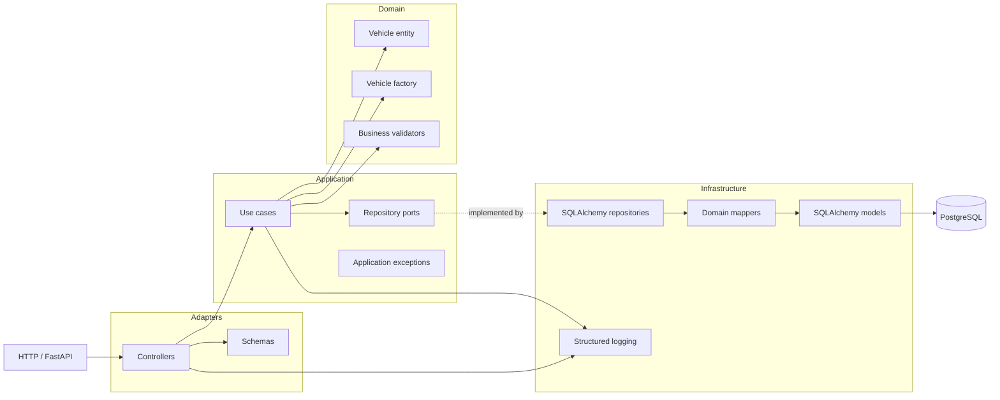
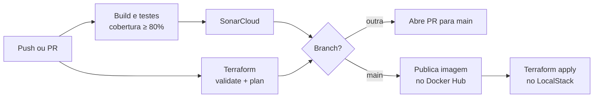

[](https://sonarcloud.io/summary/new_code?id=nessaoana_vehicle-core) [](https://sonarcloud.io/summary/new_code?id=nessaoana_vehicle-core)

# vehicle-core

Serviço principal para cadastro de veículos e operações de negócio. A imagem da
API é construída a partir de `app/`, e a stack local fornece PostgreSQL e
LocalStack.

## Arquitetura em camadas



As dependências apontam para dentro: o domínio não depende de FastAPI,
SQLAlchemy ou PostgreSQL. A infraestrutura implementa as portas definidas pela
camada de aplicação.

## Desenvolvimento local

Crie os arquivos de ambiente locais a partir de `.env.example` e execute:

```bash
python3 -m venv .venv
.venv/bin/pip install -r app/src/requirements.txt
PYTHONPATH=app .venv/bin/pytest app/tests --cov=app/src --cov-report=term-missing --cov-fail-under=80
docker compose up --build
```

Para executar a API localmente pelo terminal, use o pacote `src` como módulo:

```bash
PYTHONPATH=app .venv/bin/python -m uvicorn src.main:app \
	--host 127.0.0.1 --port 8081 --reload
```

No VS Code, selecione a configuração `Run vehicle-core API` em **Run and Debug**.
Ela executa a API na porta `8081`. Não use **Run Python File** diretamente no
arquivo `app/src/main.py`, pois os imports da aplicação usam o pacote `src`.

O container da API escuta na porta `8001`, a execução local usa `8081`, e o PostgreSQL é exposto na porta
`5433` para evitar conflitos com o serviço de venda de veículos.

## Cadastro de veículo

Com a API local em execução, cadastre um veículo usando o endpoint `POST
/vehicles`:

```bash
curl -X POST http://127.0.0.1:8081/vehicles \
	-H 'Content-Type: application/json' \
	-d '{
		"license_plate": "ABC1D23",
		"brand": "Toyota",
		"model": "Corolla",
		"year": 2024,
		"price": "75000.00",
		"color": "Black",
		"notes": "Single owner"
	}'
```

O cadastro aceita placas brasileiras no formato antigo (`ABC-1234` ou
`ABC1234`) e no formato Mercosul (`ABC1D23`). Letras minúsculas, espaços e
hífens são normalizados. Placas inválidas retornam `422` e uma placa já
cadastrada retorna `409`.

Para consultar ou editar um veículo:

```bash
curl http://127.0.0.1:8081/vehicles/1

curl -X PATCH http://127.0.0.1:8081/vehicles/1 \
	-H 'Content-Type: application/json' \
	-d '{"price": "82000.00", "model": "Yaris"}'
```

Para pesquisar veículos, use `GET /vehicles`. O resultado vem ordenado por
preço, do mais barato para o mais caro, e todos os filtros são opcionais:
`status` (`available` ou `sold`), `brand`, `model` (busca parcial, sem
diferenciar maiúsculas) e o intervalo `min_year`/`max_year`:

```bash
curl 'http://127.0.0.1:8081/vehicles?status=available&brand=toyota&min_year=2020&max_year=2024'
```

O serviço de vendas pode atualizar a disponibilidade após a compra por meio do
endpoint interno:

```bash
curl -X PATCH http://127.0.0.1:8081/vehicles/1/availability \
	-H 'Content-Type: application/json' \
	-d '{"status": "sold", "active": false}'
```

Os endpoints de observabilidade são:

```text
GET /health       # processo disponível
GET /health/ready # processo e banco disponíveis
```

## CI/CD



O CI roda em pushes para qualquer branch e em PRs para `main`:

- build e testes, com cobertura mínima de 80%;
- análise no SonarCloud, que bloqueia a alteração se o quality gate falhar;
- `terraform fmt`, `validate` e `plan`, sem apply.

Se o CI passar:

- **em outra branch**, um PR para `main` é aberto automaticamente;
- **na `main`**, o CD publica a imagem no Docker Hub e aplica o Terraform no
  LocalStack Cloud.

Os jobs usam os workflows reutilizáveis de `fiap-soat-grupo36/reusable-actions`.

## Terraform e LocalStack

A configuração Terraform em `infra/` provisiona o bucket S3
`vehicle-core-assets` e habilita o versionamento. Para fazer o deploy na
instância local do LocalStack:

```bash
cd infra
terraform init
terraform plan -out=vehicle-core-local.tfplan
terraform apply vehicle-core-local.tfplan
```

O endpoint local é `http://localhost:4566`. O workflow
[`ci.yml`](.github/workflows/ci.yml) inicia o emulador LocalStack Cloud
autenticado, executa `terraform plan` em pull requests e executa `terraform
apply` após um merge em `main`.

Esse workflow usa
`fiap-soat-grupo36/reusable-actions/.github/workflows/_reusable-terraform.yml`.

Configure `LOCALSTACK_AUTH_TOKEN` como secret do repositório ou do ambiente,
usando um LocalStack CI Auth Token. O token nunca é armazenado no repositório. O
workflow Terraform usa o proxy oficial `lstk terraform`, fazendo o Terraform
apontar para o endpoint compatível com AWS do LocalStack em vez de uma conta AWS
real.