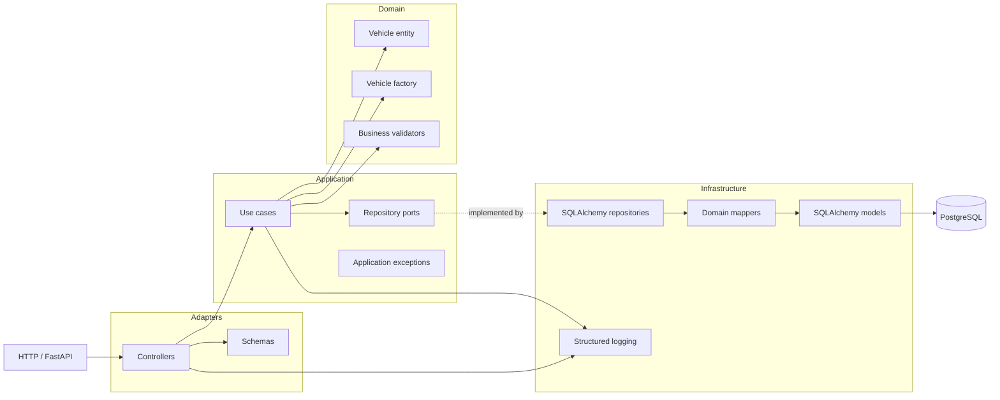

# vehicle-core

Serviço principal para cadastro de veículos e operações de negócio. A imagem da
API é construída a partir de `app/`, e a stack local fornece PostgreSQL e
LocalStack.

## Arquitetura em camadas



As dependências apontam para dentro: o domínio não depende de FastAPI,
SQLAlchemy ou PostgreSQL. A infraestrutura implementa as portas definidas pela
camada de aplicação.

## Desenvolvimento local

Crie os arquivos de ambiente locais a partir de `.env.example` e execute:

```bash
python3 -m venv .venv
.venv/bin/pip install -r app/src/requirements.txt
PYTHONPATH=app .venv/bin/pytest app/tests --cov=app/src --cov-report=term-missing --cov-fail-under=80
docker compose up --build
```

Para executar a API localmente pelo terminal, use o pacote `src` como módulo:

```bash
PYTHONPATH=app .venv/bin/python -m uvicorn src.main:app \
	--host 127.0.0.1 --port 8081 --reload
```

No VS Code, selecione a configuração `Run vehicle-core API` em **Run and Debug**.
Ela executa a API na porta `8081`. Não use **Run Python File** diretamente no
arquivo `app/src/main.py`, pois os imports da aplicação usam o pacote `src`.

O container da API escuta na porta `8001`, a execução local usa `8081`, e o PostgreSQL é exposto na porta
`5433` para evitar conflitos com o serviço de venda de veículos.

## Cadastro de veículo

Com a API local em execução, cadastre um veículo usando o endpoint `POST
/vehicles`:

```bash
curl -X POST http://127.0.0.1:8081/vehicles \
	-H 'Content-Type: application/json' \
	-d '{
		"license_plate": "ABC1D23",
		"brand": "Toyota",
		"model": "Corolla",
		"year": 2024,
		"price": "75000.00",
		"color": "Black",
		"notes": "Single owner"
	}'
```

O cadastro aceita placas brasileiras no formato antigo (`ABC-1234` ou
`ABC1234`) e no formato Mercosul (`ABC1D23`). Letras minúsculas, espaços e
hífens são normalizados. Placas inválidas retornam `422` e uma placa já
cadastrada retorna `409`.

Para consultar ou editar um veículo:

```bash
curl http://127.0.0.1:8081/vehicles/1

curl -X PATCH http://127.0.0.1:8081/vehicles/1 \
	-H 'Content-Type: application/json' \
	-d '{"price": "82000.00", "model": "Yaris"}'
```

O serviço de vendas pode atualizar a disponibilidade após a compra por meio do
endpoint interno:

```bash
curl -X PATCH http://127.0.0.1:8081/vehicles/1/availability \
	-H 'Content-Type: application/json' \
	-d '{"status": "sold", "active": false}'
```

Os endpoints de observabilidade são:

```text
GET /health       # processo disponível
GET /health/ready # processo e banco disponíveis
```

## CI/CD

O workflow de CI é executado em pull requests e pushes para `main`. Ele instala
as dependências, compila o código Python e bloqueia alterações quando a
cobertura dos testes fica abaixo de 80%. O mesmo workflow executa a análise
SonarQube e bloqueia a alteração quando o quality gate configurado falha.

O build Python usa o workflow reutilizável
`fiap-soat-grupo36/reusable-actions/.github/workflows/_reusable-build-python.yml`.
Como esse workflow não aplica um limite mínimo de cobertura, o job
`coverage-gate` executa a verificação adicional de 80%.

O job de análise usa
`fiap-soat-grupo36/reusable-actions/.github/workflows/_reusable-sonar-python.yml`
e executa no SonarCloud. Configure `SONAR_TOKEN` como secret e `SONAR_ORG` como
repository variable. Para comentar e publicar o quality gate nos PRs para
`main`, o projeto `nessaoana_vehicle-core` precisa estar vinculado ao
repositório GitHub `nessaoana/vehicle-core` no SonarCloud, com a integração do
GitHub habilitada. O workflow possui `checks: write` e `pull-requests: write`.

Após a conclusão bem-sucedida do workflow `CI` na branch `main`, o workflow de CD usa
`fiap-soat-grupo36/reusable-actions/.github/workflows/_reusable-dockerhub.yml`
para publicar a imagem `app` no Docker Hub. Configure `DOCKERHUB_USERNAME` e
`DOCKERHUB_TOKEN` no GitHub. Use `DOCKERHUB_USERNAME` como repository variable
e `DOCKERHUB_TOKEN` como secret.

Depois da publicação da imagem, o mesmo CD executa o deploy Terraform no
LocalStack Cloud usando
`fiap-soat-grupo36/reusable-actions/.github/workflows/_reusable-terraform.yml`.

Após um CI bem-sucedido em uma branch diferente de `main`,
o job `create-pr` usa
`fiap-soat-grupo36/reusable-actions/.github/workflows/_reusable-create-pr.yml`
para abrir um Pull Request automaticamente contra `main`.

Após o merge de um pull request em `main`, o workflow `cd.yml` publica a imagem
e executa o `apply` no LocalStack Cloud.

## Terraform e LocalStack

A configuração Terraform em `infra/` provisiona o bucket S3
`vehicle-core-assets` e habilita o versionamento. Para fazer o deploy na
instância local do LocalStack:

```bash
cd infra
terraform init
terraform plan -out=vehicle-core-local.tfplan
terraform apply vehicle-core-local.tfplan
```

O endpoint local é `http://localhost:4566`. O workflow
[`ci.yml`](.github/workflows/ci.yml) inicia o emulador LocalStack Cloud
autenticado, executa `terraform plan` em pull requests e executa `terraform
apply` após um merge em `main`.

Esse workflow usa
`fiap-soat-grupo36/reusable-actions/.github/workflows/_reusable-terraform.yml`.

Configure `LOCALSTACK_AUTH_TOKEN` como secret do repositório ou do ambiente,
usando um LocalStack CI Auth Token. O token nunca é armazenado no repositório. O
workflow Terraform usa o proxy oficial `lstk terraform`, fazendo o Terraform
apontar para o endpoint compatível com AWS do LocalStack em vez de uma conta AWS
real.